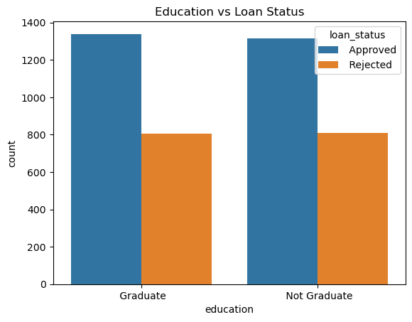

Loan Classification Project 

Project Overview
This project aims to build a machine learning model that predicts whether a loan application will be approved. It uses applicant details and financial data to streamline the loan approval process and provide data-driven insights for financial institutions. 

Dataset Summary 
The dataset includes features describing applicant demographics, financial details, and loan-specific attributes.

Key Features:
-  loan_id: Unique identifier for each application.
-  no_of_dependents: Number of dependents supported by the applicant.
-  education: Applicant's educational qualification (e.g., graduate).
-  self_employed: Indicates if the applicant is self-employed (Yes/No).
-  income_annum: Applicant’s annual income.
-  loan_amount: Requested loan amount.
-  loan_term: Loan repayment period (in years).
-  cibil_score: Applicant's credit score.
-  residential_assets_value: Value of residential properties owned.
-  commercial_assets_value: Value of commercial properties owned.
-  luxury_assets_value: Value of luxury assets (e.g., cars, jewellery).
-  bank_asset_value: Bank-held asset values (e.g., savings).
-  loan_status: Loan approval status (target variable).

Visual Insights From Exploratory Analysis

1.Loan Approvals by Education Level 

2.Income Distribution 

3.Credit Score VS loan Amount vs Loan Status

4.Feature Importance (Random Forest Classifier Model) 

Methodology  
1.Preprocessing: 
- One-hot encoded categorical variables like education and self_employed. Label Encoded the target variable Loan Status.
- Scaled numerical features like income amount, residential assets values, Cibil(credit) score, etc. 
- Split the Dataset into training and test sets, with the training set being 80 percent of the dataset. 

2.Modelling: 
- Evaluated multiple classifiers, including Logistic Regression, Decision Tree, K-Nearest Neighbour, Support Vector, and Random Forest.
- Conducted hyperparamter tuning using GridSearchCV. 

3.Evaluation:
- Metrics used: Accuracy, F1=Score, Precision, Recall, and Confusion Matrix. 

- Results 
Best Model: Random Forest Classifier.
Performance Metrics: 
	Accuracy: 98.01%
	F1-Score(Approved): 0.9842
	F1-Score(Not Approved): 0.9731
	Precision(Approved): 0.9888
	Precision(Not Approved): 0.9654
	Recall(Approved): 0.9797
	Recall(Not Approved): 0.9808

Key Insights 
- Credit score is the strongest predictor of loan approval.
- Income level also positively influences the likelihood of loan approval.
- Surprisingly, education level had no significant impact on loan approval outcomes.
	
Conclusion 
This project highlights how machine learning can efficiently predict loan approvals and provide actionable insights for financial decision-making.
